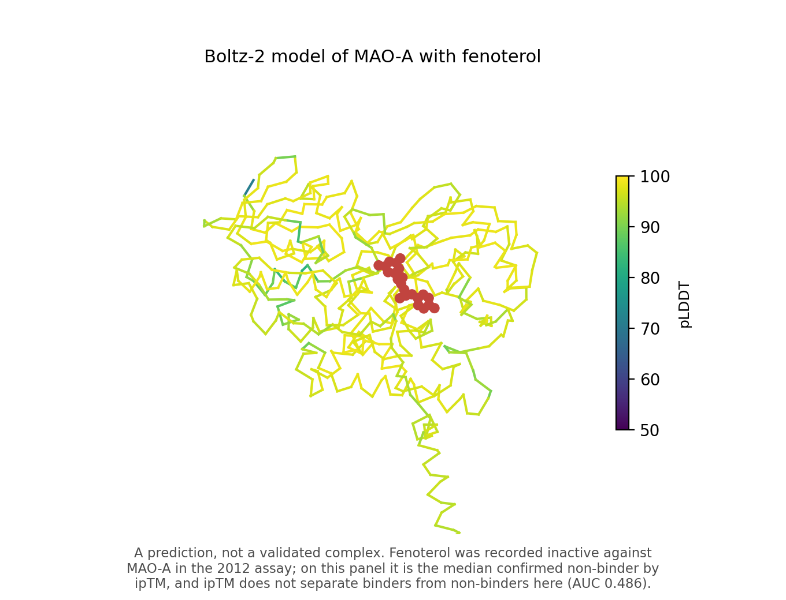
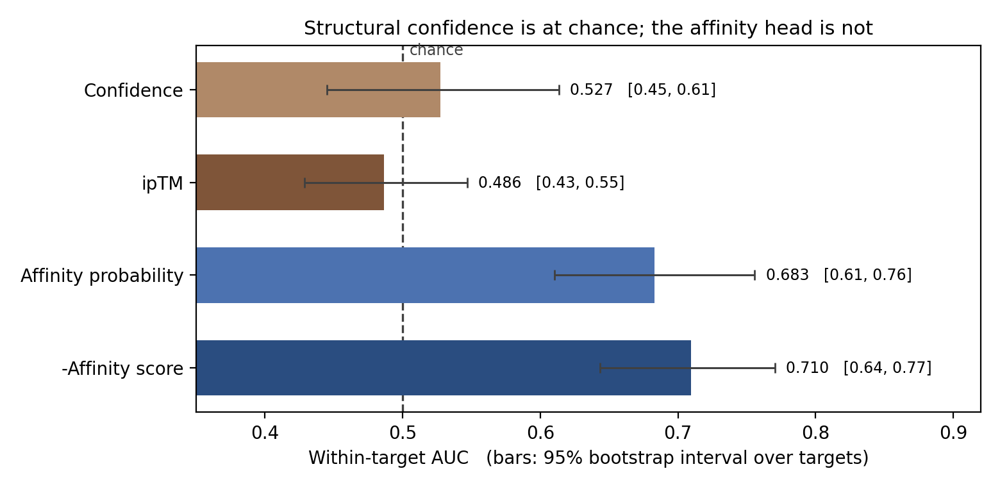
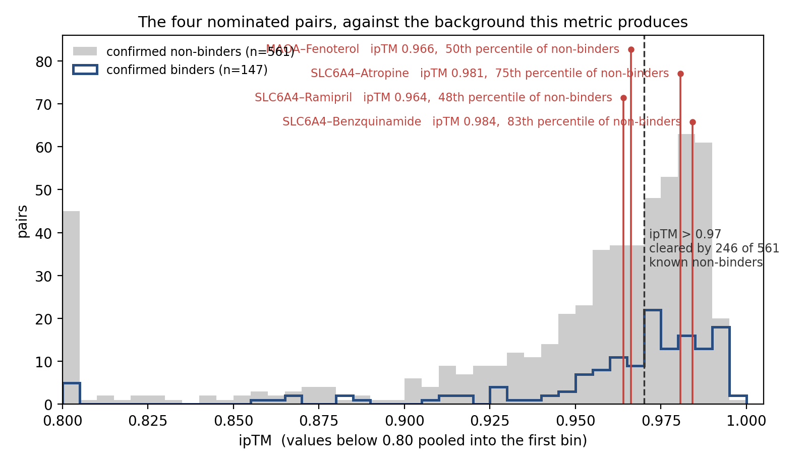

# boltz2-sea-offtarget

**Boltz-2 evaluated against the Lounkine 2012 off-target safety benchmark — and what changes
depending on which of its outputs you read.**



Structure prediction models emit several numbers per complex. This repository takes 708
target–drug pairs whose binding was measured in a published wet-lab study, and asks which of
Boltz-2's outputs can tell the confirmed binders from the confirmed non-binders.

**The answer is that its structural confidence outputs cannot and its affinity outputs can**,
which makes the choice of readout more consequential than the choice of model.

---

## Authorship and scope

Original course projects: **AICD3_201 (Nov 2025)** with Andrew Duong, Yujin Wu and Brian
Shoichet, and a follow-up (**Mar 2026**) with Andrew Duong. The data-construction pipeline, the
input audit, and the analyses in `notebooks/02`–`07` are by **Jack Fenn**.

These were student projects run on a laptop against a public dataset. Nothing here was
prospectively validated, no new off-target interaction was discovered, and the limitations
section below is the longest section in this document on purpose.

**AlphaFold 3 was never run.** It appears in this repository only as a citation. An earlier
version of this work was named as though AF3 had been benchmarked; it had not.

---

## The four findings

1. **Both structural confidence metrics discriminate at chance, including ipTM.** Within
   target, confidence reaches 0.527 and ipTM 0.486, with bootstrap intervals spanning 0.5.
   Both affinity outputs reach 0.68–0.71 with intervals that exclude it. The original null
   result was a readout choice, not a property of the model.
2. **18% of the model inputs carried expression-construct scaffold**, the two "sequence arms"
   were not defined consistently — for one target they are swapped, for another the "human"
   arm is a different species — and oligomeric state was assigned per target with no stated
   rule.
3. **A back-transform inconsistency compressed one arm's log-space error by 0.43×** and
   reversed a reported conclusion about which sequence arm was more accurate.
4. **Ranking and calibration came apart.** AUC ≈ 0.71 alongside a mean absolute error of 1.23
   log units — about 17-fold — on the predicted potency.

---

## 1. Which readout separates binders from non-binders

708 pairs, 147 assay-active, 561 assay-inactive, 63 targets. AUC is computed **within target**
and combined weighted by each target's active×inactive pairs; only the 34 targets contributing
both classes can contribute.

| Score | Pooled AUC | Within-target AUC | 95% CI |
|---|---|---|---|
| Confidence (0.8·pLDDT + 0.2·ipTM) | 0.563 | **0.527** | [0.45, 0.61] |
| ipTM (interface only) | 0.592 | **0.486** | [0.43, 0.55] |
| Affinity probability | 0.731 | 0.683 | [0.61, 0.76] |
| −Affinity score (predicted log affinity) | 0.771 | **0.710** | [0.64, 0.77] |



Pooled AUC across this table confounds real discrimination with target-level effects: targets
differ enormously in how many of their tested drugs turned out to be active, so a score that
knows nothing except *which target this is* still ranks well pooled. That gap is why
`metrics.stratified_auc` exists and why the pooled column is shown next to it rather than
instead of it.

**ipTM is the interface metric a structural biologist asks about first, and it is the worst of
the four.** So this is not a case of reading the wrong confidence number: every structural
quality score available here fails. `notebooks/07` reaches the same place independently, on a
different set of interface metrics from a different set of runs — `Ligand_ipTM` 0.488,
`Interface_PDE` 0.502, `Interface_pLDDT` 0.493.

**Reproduce:** `notebooks/03`, `results/tables/table1_auc.csv`.

## 2. What was actually handed to the model

158 committed Boltz-2 inputs, audited by `src/offtarget/constructs.py`.

| | |
|---|---|
| Inputs carrying expression-construct scaffold | **29 of 158 (18%)** |
| Modelled as homodimer / monomer | **102 / 56**, no stated rule |
| SLC6A4 construct | canonical P31645 + **exactly 55 residues** of thrombin site, twin Strep-tag, GS linkers and His12 |
| ADRA1A "PDB" construct | FLAG + His8, three glycosylation sequons mutated (N7Q, N13Q, N22Q), two thermostabilising substitutions (S113R, M115W), ICL3 deleted with a fusion remnant left in — **not the human protein** |
| SLC6A2 arms | **swapped**: the arm labelled "PDB 8HFE" is the canonical UniProt sequence verbatim; the arm labelled "UniProt" is a 566-residue hand-trim |
| PTGS1 "human" arm | 33 substitutions spread evenly across the chain at 93.9% identity, no tags — **an ortholog, not a human construct** (3KK6 is the ovine enzyme) |
| ADRA1A "UniProt" arm | only **70.4%** aligns to the reviewed P35348 record; 42 residues, including a 19-residue ICL3 block, appear nowhere in it |
| `generate_SLC29A1_yamls.py` | does not produce the files beside it — its header, sequence and target filter all say SLC6A4 / 9HCO |

Ten near-identical generator scripts, each carrying one sequence and one template in a string
literal, are replaced by **one generator driven by `inputs/targets.yaml`**, where every
per-target decision is written down along with what is wrong with it. `pytest` asserts that
regenerating from that config reproduces all 158 committed inputs **byte for byte**, so the
config is a faithful description of what was run rather than an idealised version of it.

**Did the defects move the scores?** This dataset cannot say. Tag status is a property of the
target, not of the pair, and only 8 of 63 targets have inputs in the tree, so a tag effect
cannot be separated from a target effect. That is reported as a negative result in
`notebooks/02` rather than as an effect size.

**Reproduce:** `notebooks/02`, `offtarget audit-inputs`.

## 3. The back-transform

`boltz2_result.xlsx` holds both sequence arms side by side and back-transforms the same
quantity — Boltz-2's predicted log₁₀(IC50) in µM — two different ways:

```
H2  =POWER(10,E2)      PDB arm
O2  =EXP(M2)           UniProt arm
```

Since `eˣ = 10^(0.4343·x)`, the exponential path returns a value whose log₁₀ is 0.4343·x: every
prediction is pulled toward 1 µM, and predictions are wrong mostly by being far from 1 µM.

| Mean \|log₁₀ error\| vs measured activity | Value | Fold |
|---|---|---|
| UniProt, as computed in the workbook | **0.898** | 7.9× |
| UniProt, consistent transform | 1.244 | 17.5× |
| PDB, consistent transform | 1.232 | 17.1× |

The workbook concluded from 0.898 versus 1.232 that the UniProt arm was more accurate. On a
consistent transform the arms are 1.244 and 1.232 — **the conclusion disappears and marginally
reverses.** `transforms.workbook_legacy_uniprot` reproduces the defect deliberately, is called
only from `notebooks/04`, and is pinned by a regression test.

**Reproduce:** `notebooks/04`, `results/tables/table2_calibration.csv`.

## 4. Ranking is not calibration

Mean absolute error **1.23 log₁₀ units — about 17-fold — over 119 pairs with a measured
activity**, on both arms, alongside a within-target AUC of 0.71.

These answer different questions and are not in tension. The model places binders above
non-binders more often than not, *and* its absolute potency predictions are off by more than
an order of magnitude. A ranking that works does not give you a number you can act on.

**Reproduce:** `notebooks/04`.

---

## A case study: a hypothesis of mine that the control did not support

`notebooks/06` is the part of this repository I would most want read.

In March 2026 I nominated four target–drug pairs as **silent binders** — ligands occupying a
pocket without producing activity in the 2012 functional assay — on the basis of high
interface scores. The hypothesis is reasonable: the ground truth here is positive–unlabeled, a
drug recorded inactive is one that did not move a functional readout, and a neutral antagonist
can occupy a site without moving one.

Then I asked what the nominating metric does where the answer is known:

- Within-target AUC of ipTM on this dataset: **0.486.**
- **246 of 561 confirmed non-binders (44%) clear the ipTM > 0.97 bar** used to nominate four.
- The strongest candidate is the **median confirmed non-binder** on ipTM. It ranks 6th of 24
  on its own panel, behind levodopa; ten of those 24 clear the "crystal-quality" bar,
  including acetaminophen.
- On SLC6A4 — the one target with confirmed off-target binders in the ground truth — ipTM does
  not separate the confirmed binders (mean 0.979) from my claims (0.976) from the rest of the
  panel (0.956). One of my claims ranks above two of the three drugs that actually bind. The
  affinity head does separate them, and ranks my claims lowest, at 0.426 against 0.883.
- All three SLC6A4 claims were run against the construct in §2 — the one carrying 55 residues
  of purification scaffold.



**The hypothesis may still be right. This evidence cannot establish it, and the experiment that
could is a binding assay, not a better score.** Those four pairs are not presented as findings
anywhere in this repository, and the therapeutic proposal built on one of them in the March
2026 deck is not carried here at all.

---

## Reproducing

```bash
git clone https://github.com/j-fenn/boltz2-sea-offtarget
cd boltz2-sea-offtarget
pip install -e ".[dev]"          # or: conda env create -f environment.yml

offtarget build                  # rebuild every table from the published supplement
python inputs/generate_inputs.py --check inputs/generated   # 158 inputs, byte for byte
offtarget audit-inputs           # the tag / oligomer audit
offtarget metrics                # the AUC table
offtarget figures && offtarget tables
pytest -q                        # 45 tests
```

CI runs all of the above, plus a check that no credential-shaped file is tracked and that
AlphaFold is not referenced outside a citation.

Every number in this README traces to a notebook cell and a file in `results/tables/`.

```
data/          raw sources + scored Boltz-2 outputs, unmodified   (data/README.md — read first)
inputs/        targets.yaml + one generator, reproducing all 158 model inputs
src/offtarget/ pipeline · constructs · transforms · metrics · figures · cli
notebooks/     01 dataset · 02 input audit · 03 confidence vs affinity · 04 calibration
               05 similarity · 06 the silent-binder case study · 07 monomer vs dimer
results/       figures and tables, all regenerated by the CLI
assets/        four predicted structures (.cif)
```

Notebooks are stored executed, with a jupytext source in `notebooks/src/` for clean diffs.

---

## Limitations

**Ground truth is positive–unlabeled.** Lounkine measured functional activity. A pair recorded
inactive is one that did not move that readout at the concentrations tested — not one shown
not to bind. Some of the "inactive" class are probably binders, so every discrimination number
here is a lower bound on the model and an upper bound on the label quality.

**No deposition-date filtering, and the bias runs one way.** Boltz-2's training data almost
certainly includes structures for these targets, and possibly for these complexes. Nothing here
excludes them. **This makes 0.71 an upper bound**, not a conservative estimate: memorisation
inflates apparent performance. The confidence result is not protected by this argument either —
a score that fails despite possible memorisation is failing at least this badly.

**Only 158 of the model inputs survive, covering 8 of 63 targets.** There is no run manifest;
nothing records which runs were submitted or with what settings. The input audit is an audit of
a sample and cannot claim to characterise the rest. The "1,085 runs" figure quoted in earlier
write-ups does not reconcile against anything on disk and is not used here.

**The pocket sequences were chosen by hand.** Searching RCSB, scrolling to the human entry,
copy-pasting. Section 2 is a catalogue of what that process produces, including one target
whose sequence is a 32-residue fragment of a helix and one that is the wrong species.

**Boltz-2 was run at defaults.** No seeds, no replicates, no sampling of alternative
conformations, no MSA-depth control. Run-to-run variance is unmeasured, so none of these
numbers carry a variance estimate from repeated prediction — only from resampling targets.

**Sequence length is uncontrolled.** Median 455 residues, 8.5% over 800. Regressing confidence
on length gives a slope of −0.0015 per 100 residues (r = −0.05), so the "long chains degrade"
hypothesis is not supported by this data, but it is not ruled out either — length is confounded
with target, class and construct.

**Membrane receptors dominate.** 502 of 710 pairs, almost all GPCRs. Conclusions about model behaviour are really conclusions
about model behaviour on GPCRs. The other four target classes contribute 47–56 pairs each.

**Thirty-four targets.** Every interval here rests on 34 proteins, and they are wide.

**No new off-target interactions were discovered.** The four candidates from March 2026 are
presented in `notebooks/06` as a case study in why the nominating metric cannot support them.

**Not a Boltz-2 benchmark.** One model, one dataset, no comparison against docking, against a
ligand-similarity baseline beyond SEA's own scores, or against another structure model. The
claim is about which readout to use on this data, not about how good Boltz-2 is.

---

## Citations

- Lounkine, E., Keiser, M. J., Whitebread, S., *et al.* **Large-scale prediction and testing of
  drug activity on side-effect targets.** *Nature* **486**, 361–367 (2012).
  [doi:10.1038/nature11159](https://doi.org/10.1038/nature11159) — the dataset and the ground
  truth, redistributed here as `data/raw/NIHMS373071-supplement-3.xls`.
- Keiser, M. J., Roth, B. L., Armbruster, B. N., *et al.* **Relating protein pharmacology by
  ligand chemistry.** *Nature Biotechnology* **25**, 197–206 (2007) — SEA, which generated the
  predictions.
- Passaro, S., *et al.* **Boltz-2: towards accurate and efficient binding affinity
  prediction** (2025) — the model evaluated here.
- Abramson, J., *et al.* **Accurate structure prediction of biomolecular interactions with
  AlphaFold 3.** *Nature* **630**, 493–500 (2024) — cited for the confidence-metric definitions
  only. **AlphaFold 3 was not run in this work.**

Licence: MIT for the code. The 2012 supplementary data is redistributed under the terms
attached to that publication.
